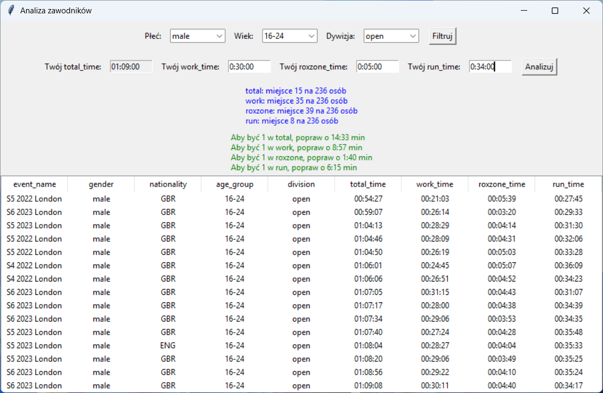

# HYROX Performance Analysis (London 2021–2023)

## Table of Contents
- General Info
- Technologies Used
- Setup
- Features
- Analysis Process
- Machine Learning Model
- Feature Importance Insights
- Interactive Application
- Key Insights
- Project Structure
- Conclusion
- Contact

---

## General Info

This project analyzes HYROX race results from London (2021–2023) with the goal of identifying the key factors that influence overall race performance.

The analysis focuses on:
- Differences between Top 10% athletes and the rest
- Performance comparison across race segments
- Impact of individual workout stations on total race time

The project also includes an interactive application for exploring the dataset dynamically, allowing users to visualize and compare performance metrics.

---

## Technologies Used

- Python 3.x  
- pandas  
- matplotlib  
- scikit-learn  
- Jupyter Notebook  

---

## Setup

1. Install Python 3.x on your computer.

2. Install required libraries:
```bash
pip install pandas matplotlib scikit-learn numpy jupyter
```

3. Download or clone the repository from GitHub.

4. Open the project folder:
Hyrox_Project/

5. Run Jupyter Notebook:
jupyter notebook

6. Open the file:
hyrox_analysis.ipynb

---

## Features

- Data loading and preprocessing from CSV
- Time conversion (HH:MM:SS → seconds)
- Correlation analysis between segments and total time
- Comparison of Top 10% vs rest of athletes
- PRO vs OPEN category analysis
- Segment contribution analysis (% share)
- Visualization using scatter plots, boxplots, and pie charts
- Machine learning model (Random Forest) to estimate performance factors
- Feature importance analysis for performance drivers
- Data-driven recommendation system

---

## Analysis Process

### 1. Data Preparation
- Converted time formats into seconds
- Handled missing values
- Created derived metrics

### 2. Correlation Analysis
- Measured relationship between segment performance and total time

### 3. Performance Segmentation
- Compared Top 10% athletes vs the rest

### 4. Category Comparison
- PRO vs OPEN division analysis

### 5. Segment Contribution
- Calculated percentage share of each segment in total race time

### 6. Ideal Athlete Profile
- Built average performance profile based on top athletes

---

## Machine Learning Model

In addition to statistical analysis, a machine learning model was developed to explore predictive relationships in the dataset.

### Model Type
- Random Forest Regressor

### Objective
- Predict total HYROX race time based on athlete and event characteristics

### Features Used
- Gender
- Age group
- Division
- Event name

### Evaluation Metrics
- MAE (Mean Absolute Error): ~740 seconds (~12 minutes)
- R² Score: ~0.05

### Key Findings
- The model shows that demographic and category-based features have limited predictive power for exact race time
- However, it reveals structural patterns in performance differences between athlete groups

---

## Feature Importance Insights (ML)

The model identified the most influential factors affecting performance:

- Age group is the strongest predictor of race time
- Gender has a moderate impact on performance differences
- Athlete division (PRO vs OPEN) significantly affects results
- Event variation also contributes to performance differences

These findings align with statistical analysis results and confirm observed performance patterns.

---

## Interactive Application

An interactive application was developed to explore the dataset dynamically.

It allows users to:
- Visualize performance metrics
- Compare segment times interactively
- Explore key performance drivers in HYROX races

## Preview



---

## Key Insights

- Run and Work segments are the strongest predictors of overall performance
- Roxzone has a lower impact compared to other segments
- Run accounts for approximately 50% of total race time
- Top 10% athletes perform significantly better in Run and Work segments
- Improving Run performance provides the highest potential improvement in total time
- A machine learning model confirmed that demographic factors influence performance patterns, although they are not sufficient to accurately predict race outcomes

---

## Project Structure

- Hyrox_Project/
  - data/
    - london_2021_2023.csv
  - assets/
    - screenshot.png
  - hyrox_analysis.ipynb
  - ml_model.py
  - app.py
  - README.md

---

## Conclusion

This project combines statistical analysis and machine learning to explore HYROX performance dynamics.

Key findings show that HYROX performance is primarily driven by endurance efficiency and execution in key segments.

The most impactful improvement areas are:
- Running efficiency under fatigue
- Work station performance consistency

The machine learning model validates these findings, showing that while demographic factors influence performance trends, they are not sufficient to accurately predict exact race outcomes.

---

## Contact

Damian  
Aspiring Data Analyst