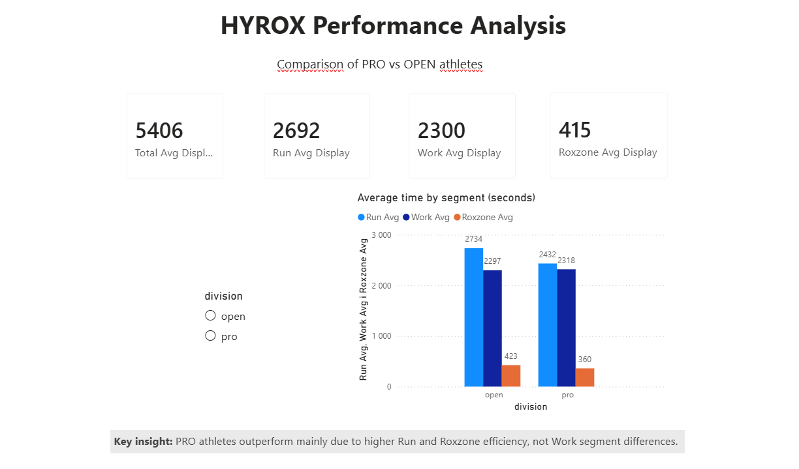

# HYROX Performance Analysis (London 2021–2023)

## Table of Contents
- General Info
- Technologies Used
- Setup
- Features
- Analysis Process
- Machine Learning Model
- Feature Importance Insights
- Interactive Application
- Power BI Dashboard
- Key Insights
- Project Structure
- Conclusion
- Contact

---

## General Info

This project analyzes HYROX race results from London (2021–2023) with the goal of identifying the key factors that influence overall race performance.

The analysis focuses on:
- Differences between Top 10% athletes and the rest
- Performance comparison across race segments
- Impact of individual workout stations on total race time

The project also includes an interactive application for exploring the dataset dynamically, allowing users to visualize and compare performance metrics.

---

## Technologies Used

- Python 3.x  
- pandas  
- matplotlib  
- scikit-learn  
- Jupyter Notebook  
- Power BI (DAX)

---

## Setup

1. Install Python 3.x on your computer.

2. Install required libraries:
   pip install pandas matplotlib scikit-learn numpy jupyter

3. Download or clone the repository from GitHub.

4. Open the project folder:
   Hyrox_Project/

5. Run Jupyter Notebook:
   jupyter notebook

6. Open the file:
   hyrox_analysis.ipynb

---

## Features

- Data loading and preprocessing from CSV
- Time conversion (HH:MM:SS → seconds)
- Correlation analysis between segments and total time
- Comparison of Top 10% vs rest of athletes
- PRO vs OPEN category analysis
- Segment contribution analysis (% share)
- Visualization using scatter plots, boxplots, and pie charts
- Machine learning model (Random Forest) to estimate performance factors
- Feature importance analysis for performance drivers

---

## Analysis Process

### 1. Data Preparation
- Converted time formats into seconds
- Handled missing values
- Created derived metrics

### 2. Correlation Analysis
- Measured relationship between segment performance and total time

### 3. Performance Segmentation
- Compared Top 10% athletes vs the rest

### 4. Category Comparison
- PRO vs OPEN division analysis

### 5. Segment Contribution
- Calculated percentage share of each segment in total race time

---

## Machine Learning Model

A Random Forest Regressor was used to explore performance patterns.

### Objective
- Predict total HYROX race time based on athlete and event characteristics

### Features Used
- Gender
- Age group
- Division
- Event name

### Results
- MAE: ~740 seconds (~12 minutes)
- R² Score: ~0.05

### Key Finding
- Demographic features alone are not sufficient to accurately predict race performance, but reveal structural patterns between athlete groups.

---

## Feature Importance Insights

- Age group is the strongest predictor of performance differences
- Gender has moderate influence
- Division (PRO vs OPEN) significantly impacts results
- Event variation contributes to performance differences

---

## Interactive Application

An interactive application was developed to explore HYROX performance data.

### Features:
- Dynamic visualization of performance metrics
- Comparison of athlete segments
- Exploration of key performance drivers

### Preview:

---

## Power BI Dashboard

An additional Power BI dashboard was created to visualize HYROX performance differences between PRO and OPEN athletes.

### Features:
- KPI metrics (Run, Work, Roxzone, Total time)
- Segment comparison between PRO and OPEN
- Interactive slicer for division filtering
- Key insight highlighting main performance drivers

### Files:
- hyrox_dashboard.pbix
- assets/HYROX_dashboard_screenshot.png

### Preview:

---

## Key Insights

- Run and Roxzone segments are the main drivers of performance differences
- Work segment shows similar performance between PRO and OPEN athletes
- Roxzone efficiency has a strong impact on overall race time
- Improving Run performance provides the highest potential time gain

---

## Project Structure

- Hyrox_Project/
  - data/
    - london_2021_2023.csv
  - assets/
    - HYROX_dashboard_screenshot.png
    - screenshot.png
  - hyrox_analysis.ipynb
  - ml_model.py
  - app.py
  - hyrox_dashboard.pbix
  - README.md

---

## Conclusion

This project combines statistical analysis, machine learning, and Power BI visualization to explore HYROX performance dynamics.

The results show that race performance is primarily driven by endurance efficiency and transition speed rather than demographic factors.

---

## Contact

Damian  
Aspiring Data Analyst